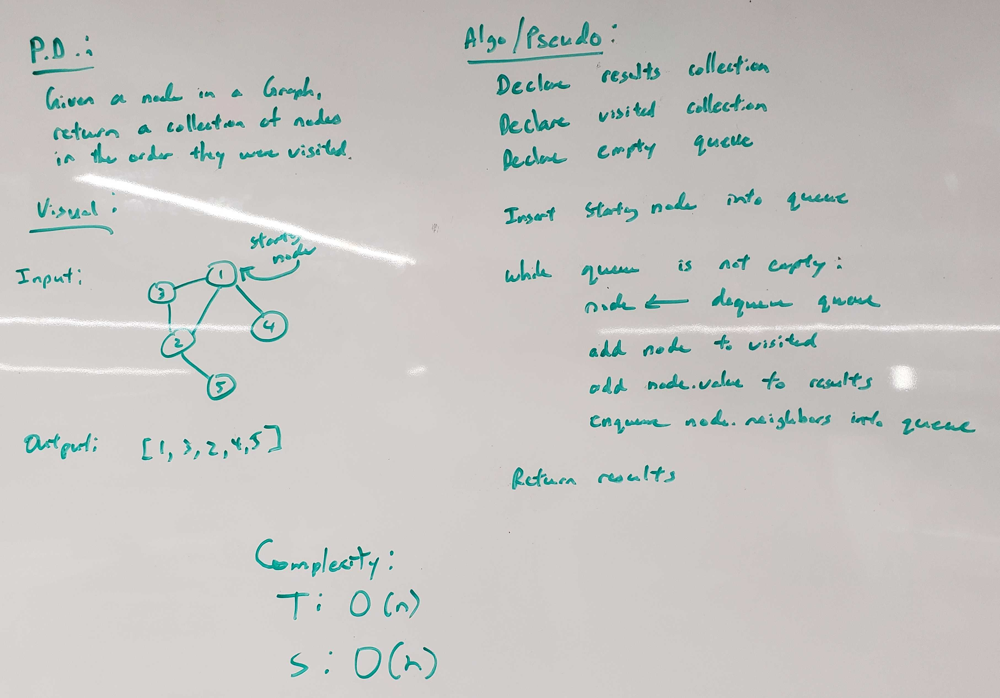

# Breadth First Graph
<!-- Short summary or background information -->
This is the implementation of a Breadth First Traversal in a graph in Java

## Challenge Description
<!-- Description of the challenge -->
The graph data structure will have a new method:
* `breadthFirst`
  * Will traverse the Graph in a breadth first manner

## Approach & Efficiency
<!-- What approach did you take? Why? What is the Big O space/time for this approach? -->
* `breadthFirst()` - O(n)

## API
<!-- Description of each method publicly available to your Linked List -->
* `public ArrayList<T> breadthFirst(GraphNode<T> node)` - accepts a starting node and returns an array list of all the nodes in the order they were visited. 

## Solution (Code)
<!-- Link to code -->
[Breadth First Code](https://github.com/stephenchu530/data-structures-and-algorithms/blob/master/BreadthFirstGraph/src/main/java/BreadthFirstGraph/BreadthFirst.java)

## Solution (Whiteboard)
<!-- Link to image -->
