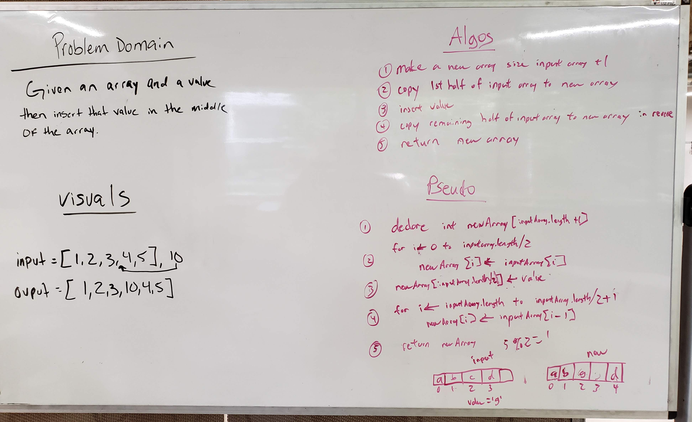

# Array Shift
<!-- Short summary or background information -->
This challenge is the warm up for course 401 code challenges and to learn how to use Gradle + IntelliJ.

## Challenge Description
<!-- Description of the challenge -->
 Takes in an array of ints and an int value to be added. Without utilizing any of the built-in methods available in Java, return an int array with the new int value added at the middle index.

## Approach & Efficiency
<!-- What approach did you take? Why? What is the Big O space/time for this approach? -->
Fairly simple approach.
* Time: O(n)
* Space: O(n)

## Solution (Code)
<!-- Link to code -->
[Solution Code](https://github.com/stephenchu530/data-structures-and-algorithms/blob/array_shift/CodeChallenges401/src/main/java/CodeChallenges401/ArrayShift.java)

## Solution (Whiteboard)
<!-- Embedded whiteboard image -->

