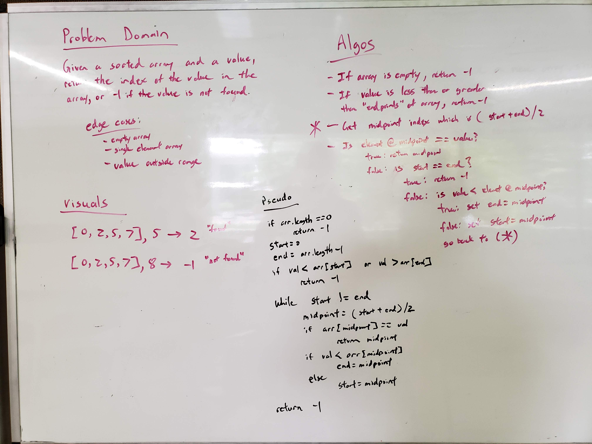

# Binary Search
<!-- Short summary or background information -->
This search algorithm code challenge is used to further our understanding of Java syntax as well as introduce us to the idea of time and space complexity.

## Challenge Description
<!-- Description of the challenge -->
Write a function called BinarySearch which takes in 2 parameters: a sorted array and the search key. Without utilizing any of the built-in methods available to your language, return the index of the array’s element that is equal to the search key, or -1 if the element does not exist

## Approach & Efficiency
<!-- What approach did you take? Why? What is the Big O space/time for this approach? -->
Fairly simple approach.
* Time: O(lg(n))
* Space: O(1)

## Solution (Code)
<!-- Link to code -->
[Solution Code](https://github.com/stephenchu530/data-structures-and-algorithms/blob/master/CodeChallenges401/src/main/java/CodeChallenges401/BinarySearch.java)

## Solution (Whiteboard)
<!-- Embedded whiteboard image -->

