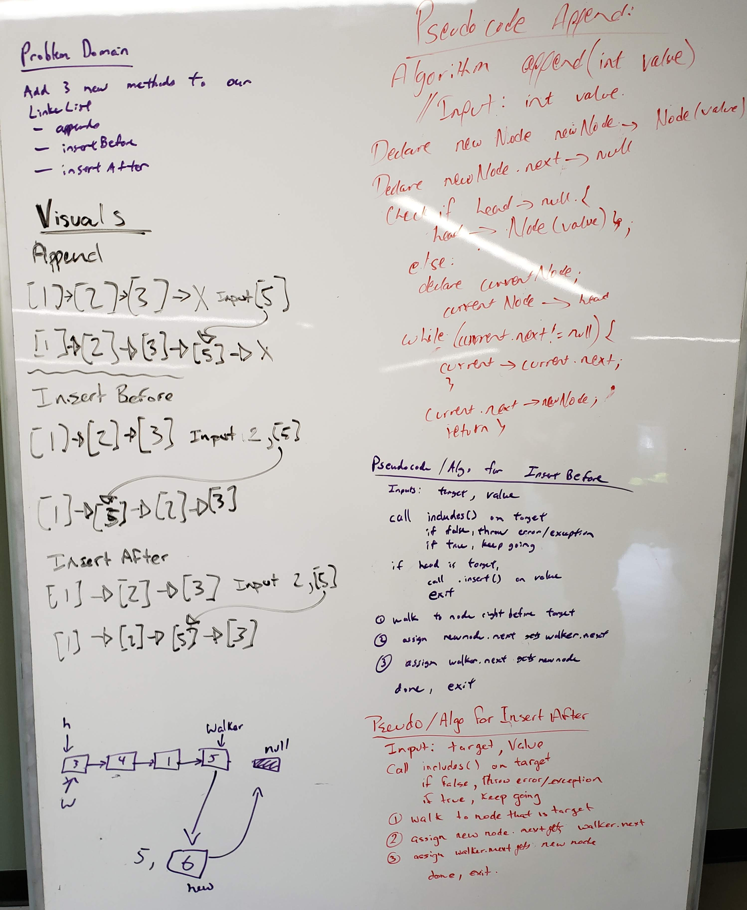
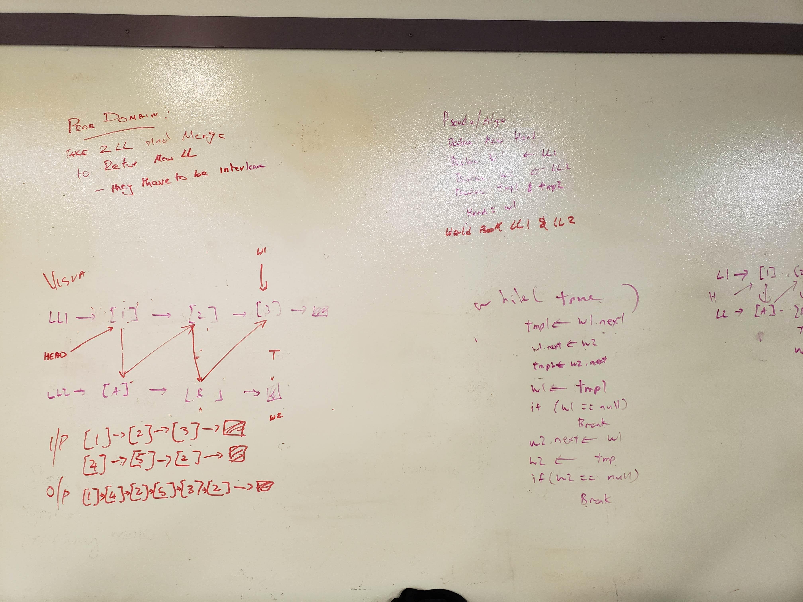

# Linked List
<!-- Short summary or background information -->
Parts of this project was solo and some parts was done as a group. It is to showcase the linked list data structure in Java 8.

## Challenge Description
<!-- Description of the challenge -->
The following are the specs for this project:
* Create a `Node` class with a property to the stored value and to the next `Node`.
* Create a `LinkedList` class with the following:
  * Instantiates an empty linked list assigned to the property `head`.
  * A method `insert` that takes in an argument and adds a new `Node` to the head.
  * A method `includes` that takes in an argument and returns true or false if the value exists in the linked list.
  * A method `print` that displays to screen the linked list.
  * A method `toString` that returns the string representation of the linked list.
  * A method `append` that takes in an argument and adds a new `Node` to the end.
  * A method `insertBefore` that inserts a new node *before* a node with a given value.
  * A method `insertAfter` that inserts a new node *after* a node with a given value.
  * A method `kthFromEnd` that retrieves the node value at kth position from the end of the linked list.
  * A method `findMiddle` that returns the node value of the middle node in the linked list.
  * A method `mergeLists` that zips two linked lists and returns the pointer to the new linked list.

## Approach & Efficiency
<!-- What approach did you take? Why? What is the Big O space/time for this approach? -->
* `insert` - O(1)
* `includes` - O(n)
* `print` - O(n)
* `toString` - O(n)
* `append` - O(1)
* `insertBefore` - O(n)
* `insertAfter` - O(n)
* `kthFromEnd` - O(n)
* `findMiddle` - O(n)
* `mergeLists` - O(n)

## API
<!-- Description of each method publicly available to your Linked List -->
* `void LinkedList.insert(int value)` - Takes in an integer value and adds a new `Node` to the head of the linked list. 

* `boolean LinkedList.includes(int value)` - Takes in an integer value and returns a true or false if the integer value exists in any of the nodes of the linked list.

* `void LinkedList.print()` - Takes no arguments and prints to screen the string representation the linked list.

* `String LinkedList.toString()` - Takes no arguments and returns the string representation of the linked list.

* `void LinkedList.append(int value` - Takes in an integer value and adds a new `Node` to the end of the linked list.

* `void LinkedList.insertBefore(int target, int value)` - Takes and an integer value and inserts a new `Node` before the node containing the integer target.

* `void LinkedList.insertAfter(int target, int value)` - Takes an integer value and inserts a new `Node` after the node containing the integer target.

* `int LinkedList.kthFromEnd(int position)` - Takes in an integer position and returns the node value at that position from the *end* of the linked list.

* `int LinkedList.findMiddle()` - Takes no arguments and returns the value of the middle node.

* `LinkedList LinkedList.mergeLists(LinkedList list1, LinkedList list2)` - Takes two linked list arguments, zips them together, and returns a reference to the new linked list.

## Solution (Code)
<!-- Link to code -->
[Solution Code](https://github.com/stephenchu530/data-structures-and-algorithms/blob/master/CodeChallenges401/src/main/java/CodeChallenges401/LinkedList.java)

## Solution (Whiteboard)
<!-- Embedded whiteboard image -->
Insertion Task

kth From End Task

Merge Lists Taks

