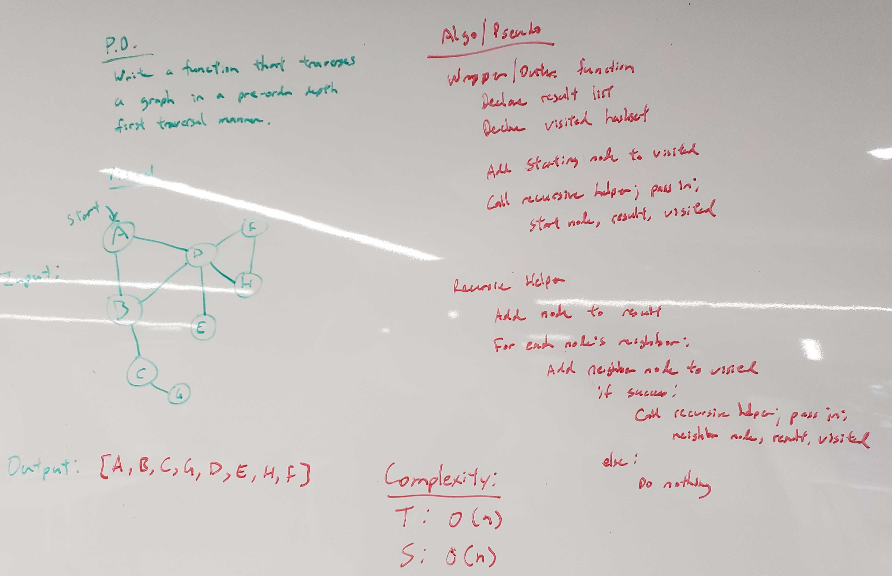

# Get Edge
<!-- Short summary or background information -->
This is the implementation of a pre-order traversal for a graph in Java

## Challenge Description
<!-- Description of the challenge -->
Create a function that accepts an adjacency list as a graph, and conducts a depth first traversal. Without utilizing any of the built-in methods available to your language, return a collection of nodes in their pre-order depth-first traversal order.
* `depthFirst()`
  * Will take in an array of node values and return true or false if there exists a path along with the sum of edge weights.

## Approach & Efficiency
<!-- What approach did you take? Why? What is the Big O space/time for this approach? -->
* `depthFirst()` - O(n)

## API
<!-- Description of each method publicly available to your Linked List -->
* `public ArrayList<T> depthFirst(GraphNode<T> startNode)` - takes in a starting node in a graph and returns an `arrayList` of visited nodes in pre-order depth traversal. 

## Solution (Code)
<!-- Link to code -->
[Depth First Code](https://github.com/stephenchu530/data-structures-and-algorithms/blob/master/DepthFirst/src/main/java/DepthFirst/Graph.java)

## Solution (Whiteboard)
<!-- Link to image -->

