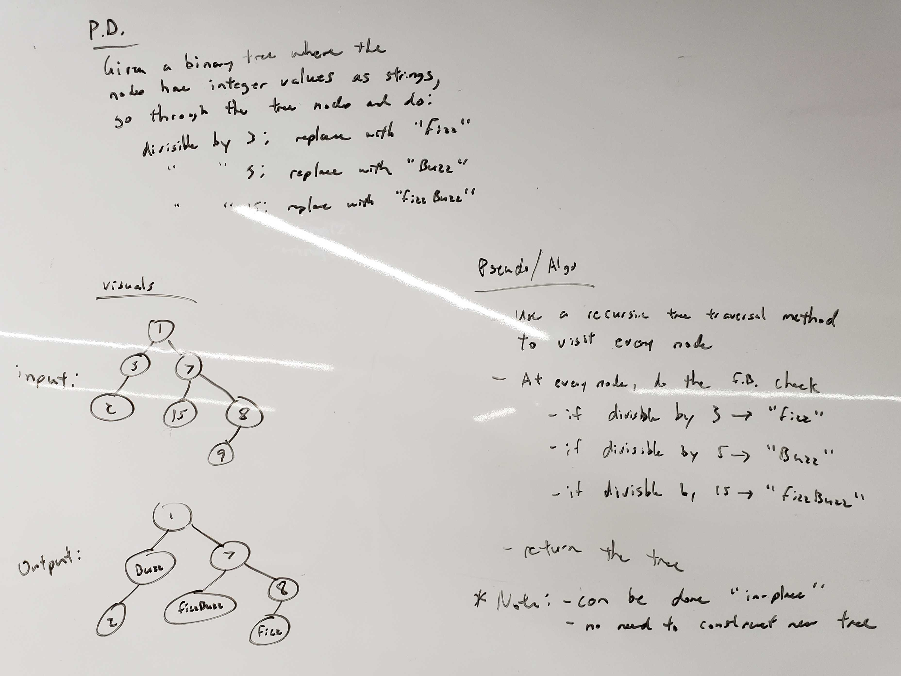

# Fizz Buzz Tree

## Description
This project uses what we learned about binary trees and combines it with the old classic Fizz Buzz

## Installation
```
 $ git clone git@github.com:stephenchu530/data-structures-and-algorithms.git
```
or
```
 $ git clone https://github.com/stephenchu530/data-structures-and-algorithms.git
```
and then
```
 $ cd data-structures-and-algorithms
```

## Usage
```
 $ ./gradlew run
```

example output:
```
Original Tree:
       24               
      / \       
     /   \      
    /     \     
   /       \    
   17       28       
  / \       \   
 /   \       \  
 11   20       3   
              \ 
              9 
                                
Fizz Buzz Tree:
       Fizz               
      / \       
     /   \      
    /     \     
   /       \    
   17       28       
  / \       \   
 /   \       \  
 11   Buzz       Fizz   
              \ 
              Fizz 
```

## Approach & Efficiency
The overall solution is based on a recursive pre-order traversal. Every node in the tree is visited once to determine if `Fizz`, `Buzz`, or `FizzBuzz`.

Time Complexity: `O(n)`

Space Complexity: `O(1)`

## Solution (Code)
<!-- Link to code -->
[Fizz Buzz Tree](https://github.com/stephenchu530/data-structures-and-algorithms/blob/master/FizzBuzzTree/src/main/java/FizzBuzzTree/App.java)

## Solution (Whiteboard)
<!-- Embedded whiteboard image -->


## Contributors
* Stephen Chu, [stephenchu530](https://github.com/stephenchu530)

## License
[](https://github.com/stephenchu530/songr/blob/master/LICENSE)

