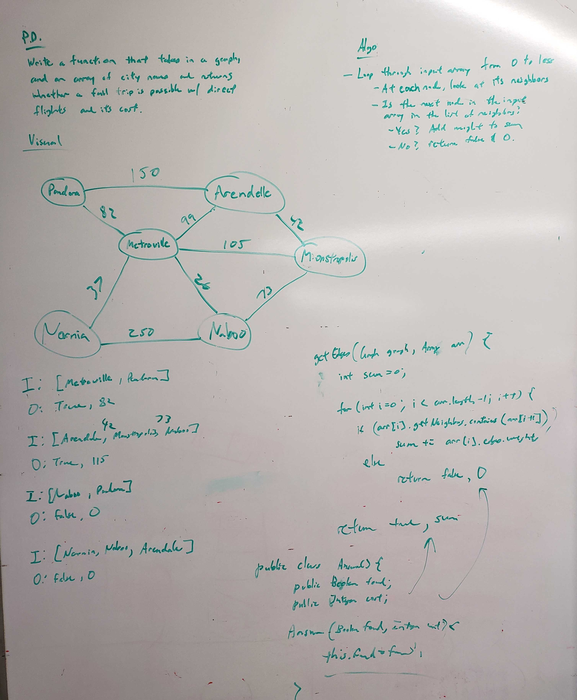

# Get Edge
<!-- Short summary or background information -->
This is the implementation of a Get Edges algorithm in Java

## Challenge Description
<!-- Description of the challenge -->
Write a function based on the specifications above, which takes in a graph, and an array of city names. Without utilizing any of the built-in methods available to your language, return whether the full trip is possible with direct flights, and how much it would cost.
* `getEdge()`
  * Will take in an array of node values and return true or false if there exists a path along with the sum of edge weights.

## Approach & Efficiency
<!-- What approach did you take? Why? What is the Big O space/time for this approach? -->
* `getEdge()` - O(n)

## API
<!-- Description of each method publicly available to your Linked List -->
* `public String[] getEdge(Graph<T> graph, T[] arr)` - accepts an array list of nodes and returns a boolean if there exists a path in the order of the given node values along with the sum of the edge weights. 

## Solution (Code)
<!-- Link to code -->
[Get Edge Code](https://github.com/stephenchu530/data-structures-and-algorithms/blob/master/GetEdge/src/main/java/GetEdge/GetEdge.java)

## Solution (Whiteboard)
<!-- Link to image -->

