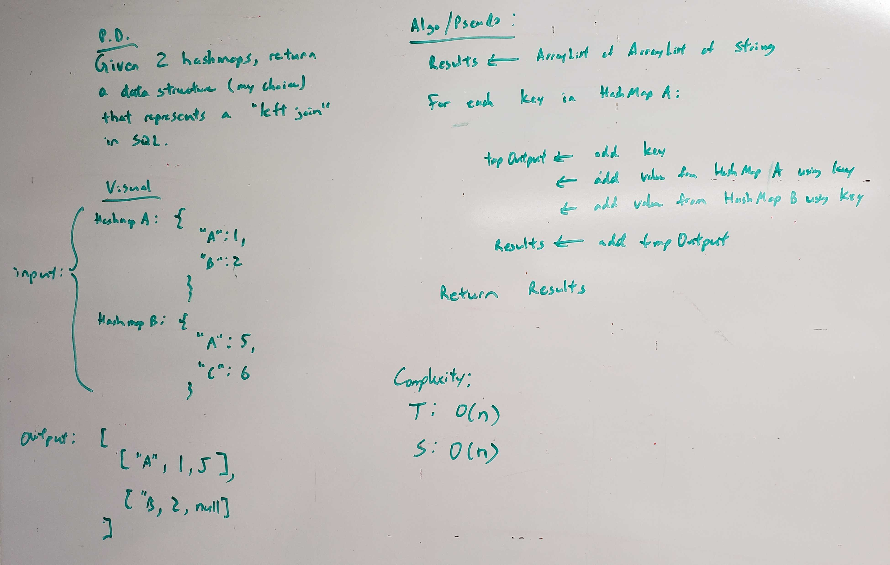

# Left Join
<!-- Short summary or background information -->
This is a solo code challenge project to solve a problem.

## Challenge Description
<!-- Description of the challenge -->
* Write a function called `leftJoin` that takes two hashmaps and returns a data structure that represents a left join from SQL.

## Approach & Efficiency
<!-- What approach did you take? Why? What is the Big O space/time for this approach? -->
* `leftJoin` method:
  * Time Complexity: O(n)
  * Space Complexity: O(n)

## API
<!-- Description of each method publicly available to your Linked List -->
* `ArrayList leftJoin(HashMap left, HashMap right)` - takes in two hashmaps and returns an array that represents a left join as done in SQL.

## Solution (Code)
<!-- Link to code -->
[Left Join Code](https://github.com/stephenchu530/data-structures-and-algorithms/blob/master/LeftJoin/src/main/java/LeftJoin/LeftJoin.java)

## White Board Pic
<!-- Link to image -->

