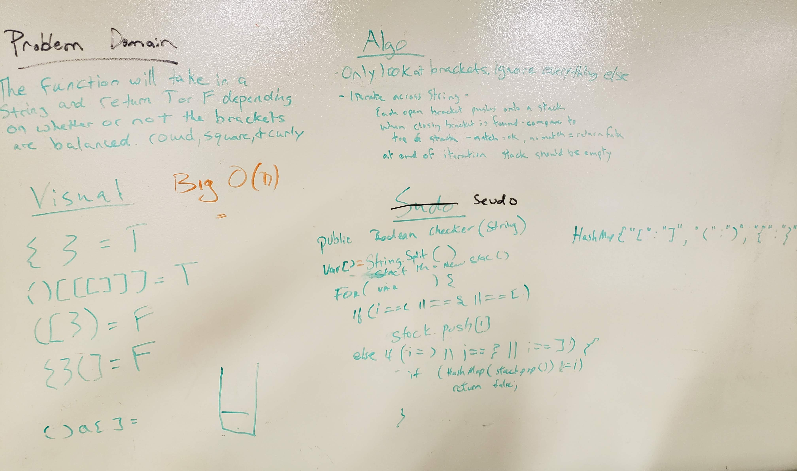

# Multi Bracket Validation
<!-- Short summary or background information -->
This is a solo code challenge project that builds upon the lessons learned from linked lists, queues, and stacks.

## Challenge Description
<!-- Description of the challenge -->
Create an app that takes in a string argument that contains brackets `[]`, `{}`, and `()`, and returns a boolean whether or not the brackets in the string are balanced.

## Installation
<!-- How to install -->
```
 $ git clone git@github.com:stephenchu530/data-structures-and-algorithms.git
 $ cd data-structures-and-algorithms
 $ cd MultiBracketValidation
 $ ./gradlew build
 $ ./gradelw test
```
If all is well, neither the last two commands should fail. If it does, troubleshoot on your own.

## Usage
<!-- How to use -->
```
 $ ./gradlew run --args '<input string containing brackets>'
```
For example:
```
 $ ./gradlew run --args '{{[][](())}}'
   true
   
 $ ./gradlew run --args '{{[(][)]}}'
   false
```

## Approach & Efficiency
<!-- What approach did you take? Why? What is the Big O space/time for this approach? -->
* Time complexity - `O(n)`
* Space complexity - `O(n)`

## Solution (Code)
<!-- Link to code -->
[Multi Bracket Validation Code](https://github.com/stephenchu530/data-structures-and-algorithms/blob/master/MultiBracketValidation/src/main/java/MultiBracketValidation/App.java)

## Solution (Whiteboard)
<!-- Embedded whiteboard image -->

