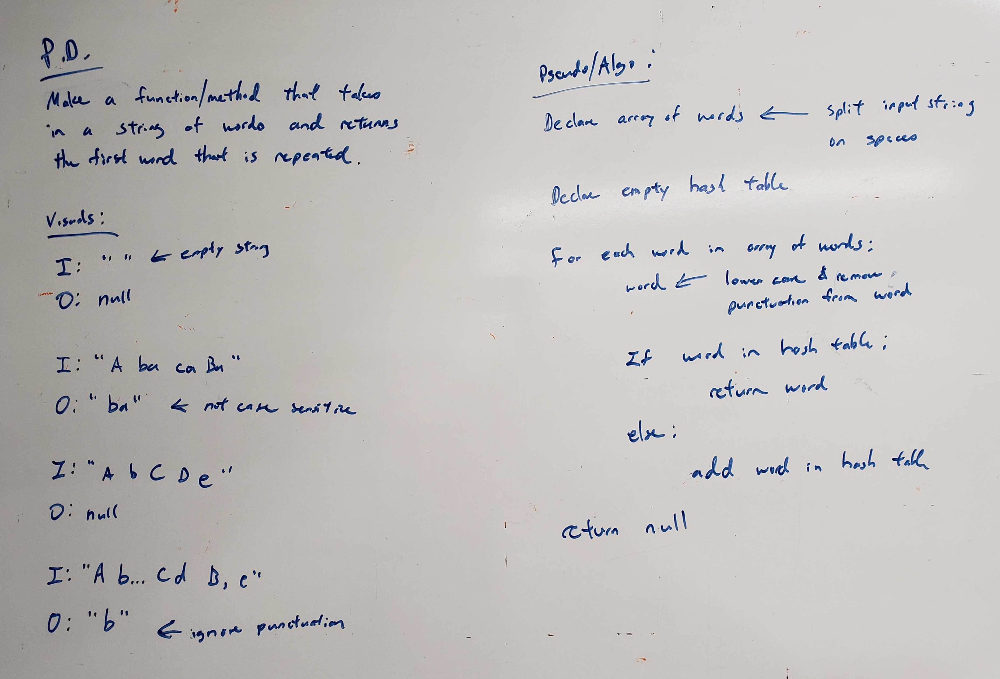

# Repeated Word
<!-- Short summary or background information -->
This is a solo code challenge project to solve a problem.

## Challenge Description
<!-- Description of the challenge -->
* Write a function that accepts a lengthy string parameter.
* Without utilizing any of the built-in library methods available to your language, return the first word to occur more than once in that provided string.

## Approach & Efficiency
<!-- What approach did you take? Why? What is the Big O space/time for this approach? -->
* `repeatedWord` - O(n)

## API
<!-- Description of each method publicly available to your Linked List -->
* `string repeatedWord(String longStringOfWords)` - takes in a string of words `longStringOfWords` and returns the first word that is repeated. If no word is repeated, the `null` will be returned.

## Solution (Code)
<!-- Link to code -->
[Repeated Word Code](https://github.com/stephenchu530/data-structures-and-algorithms/blob/master/RepeatedWord/src/main/java/RepeatedWord/RepeatedWord.java)

## White Board Pic
<!-- Link to image -->

