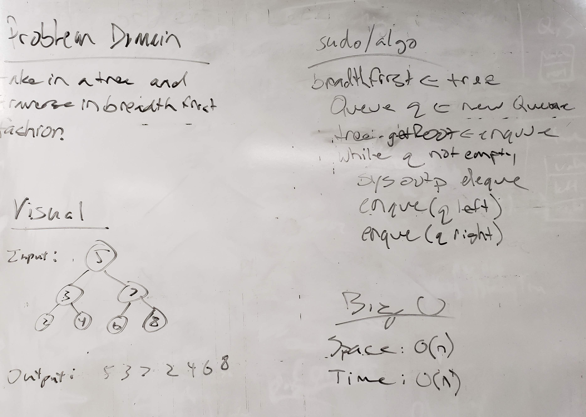

# Breadth First
<!-- Short summary or background information -->
This is a solo code challenge project to traverse a tree by breadth first.

## Challenge Description
<!-- Description of the challenge -->
The following are the specs for this project:
Extend the `BinaryTree` class

Input: Binary tree

Output: Display of the values in the binary search tree in breadth first traversal order.

## Approach & Efficiency
<!-- What approach did you take? Why? What is the Big O space/time for this approach? -->
Time Complexity: `O(n)`
Space Complexity: `O(n)`

## API
<!-- Description of each method publicly available to your Linked List -->
* `void BinaryTree.breadthFirst()` - displays to screen the values in the 

## Solution (Code)
<!-- Link to code -->
[Breadth First Code](https://github.com/stephenchu530/data-structures-and-algorithms/blob/master/Tree/src/main/java/Tree/BinaryTree.java)

*Note:* Code located within `BinaryTree` class

## Solution (Whiteboard)
<!-- Embedded whiteboard image -->

