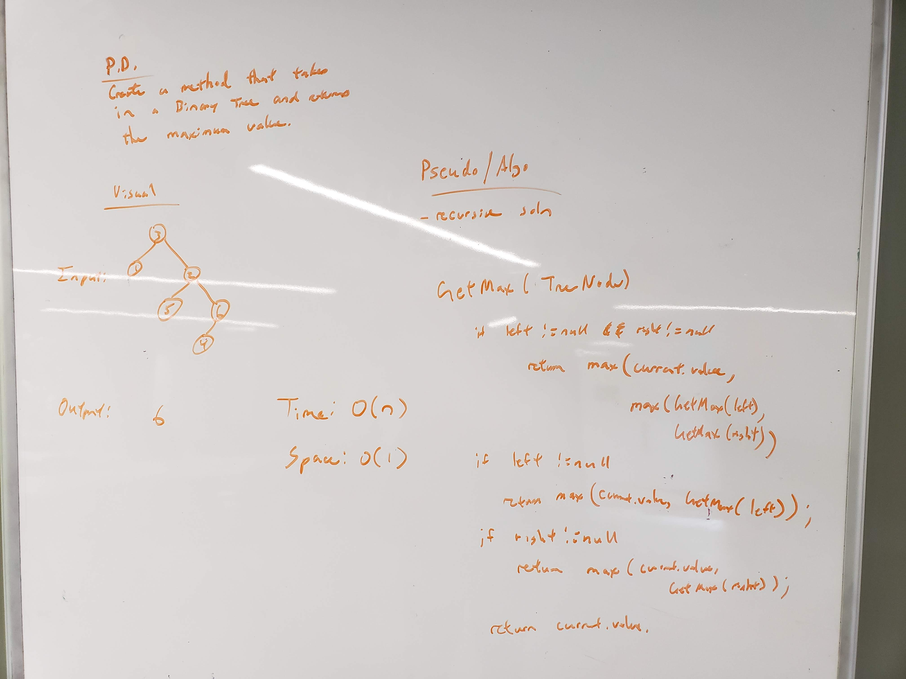

# Find Maximum Value
<!-- Short summary or background information -->
This is a solo code challenge project to find the maximum value within a `Binary Tree`

## Challenge Description
<!-- Description of the challenge -->
The following are the specs for this project:
* Extend the `BinaryTree` class

* Input: Binary tree

* Output: Display to screen the maximum value in the `Binary Tree`

## Approach & Efficiency
<!-- What approach did you take? Why? What is the Big O space/time for this approach? -->
Time Complexity: `O(n)`

Space Complexity: `O(1)`

## API
<!-- Description of each method publicly available to your Linked List -->
* `void BinaryTree.getMax()` - displays to screen the maximum value in the `Binary Tree` 

## Solution (Code)
<!-- Link to code -->
[Find Maximum Value Code](https://github.com/stephenchu530/data-structures-and-algorithms/blob/master/Tree/src/main/java/Tree/BinaryTree.java)

*Note:* Code located within `BinaryTree` class

## Solution (Whiteboard)
<!-- Embedded whiteboard image -->

