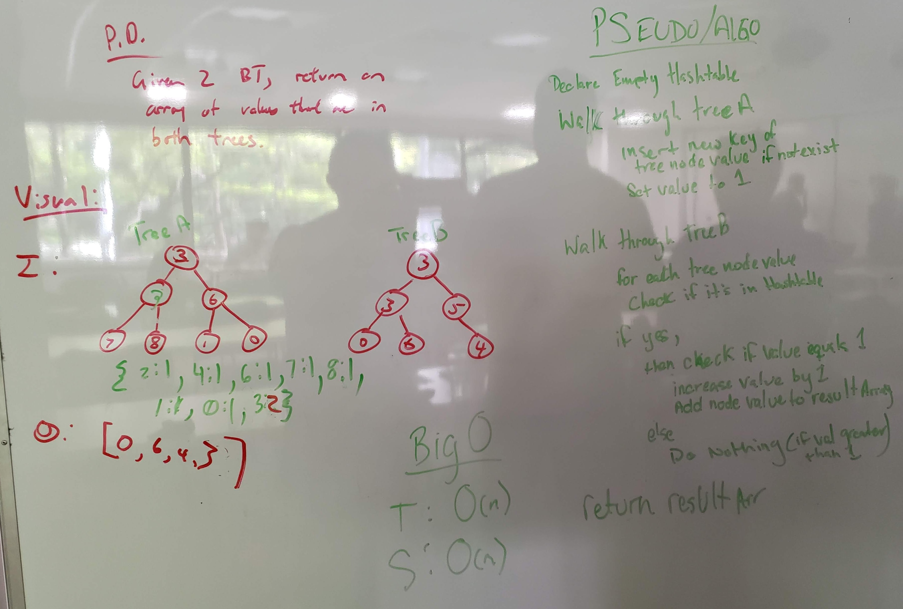

# Tree Intersection
<!-- Short summary or background information -->
This is a solo code challenge project to solve a problem.

## Challenge Description
<!-- Description of the challenge -->
* Write a function called `treeIntersection` that takes two binary tree parameters.
* Return a set of values found in both trees.

## Approach & Efficiency
<!-- What approach did you take? Why? What is the Big O space/time for this approach? -->
* `treeIntersection` method:
  * Time Complexity: O(n)
  * Space Complexity: O(n)

## API
<!-- Description of each method publicly available to your Linked List -->
* `HashSet treeIntersection(bTree treeA, bTreeB)` - takes in two binary trees and returns a set containing the common values in both binary trees

## Solution (Code)
<!-- Link to code -->
[Tree Intersection Code](https://github.com/stephenchu530/data-structures-and-algorithms/blob/master/TreeIntersection/src/main/java/TreeIntersection/TreeIntersection.java)

## White Board Pic
<!-- Link to image -->

