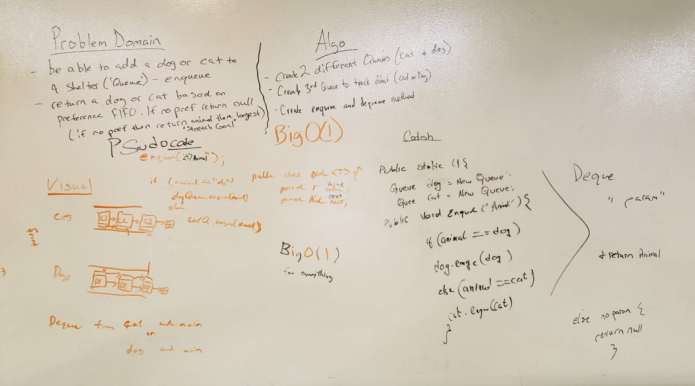

# FIFO Animal Shelter
<!-- Short summary or background information -->
This is a solo code challenge project that builds upon the lessons learned from linked lists, queues, and stacks.

## Challenge Description
<!-- Description of the challenge -->
The following are the specs for this project:
* Create a `Node` class with a property to the stored value and to the next `Node`.
  * This `Node` class will be an `animal` that could be either a `cat` or `dog`.
* Create a `Queue` class with the following:
  * One `Queue` will be a `cat` queue.
  * Another `Queue` will be a `dog` queue.
  * A method `enqueue` that takes in an argument that specifies either `cat` or `dog` and adds a new `Node` of that `animal` type to the back of the appropriate queue.
  * A method `dequeue` that takes in an argument that specifies `cat`, `dog`, or `no pref` (in whatever manner) and returns the `cat` or `dog` object from the respective queue. If `no pref` was passed in, then the program returns a `null` (for now).

## Approach & Efficiency
<!-- What approach did you take? Why? What is the Big O space/time for this approach? -->
* `enqueue` - O(1)
* `dequeue` - O(1)

## API
<!-- Description of each method publicly available to your Linked List -->
* `void Queue.enqueue(String animal)` - Takes in a String type denoting `cat` or `dog` and adds that `node` type to the appropriate queue.

* `T Queue.dequeue(String animal)` - Takes in a String type denoting `cat`, `dog`, or `null` and removes that `animal` from front of the respective queue. If `null` was passed in, the null `will` be returned (for now).

## Solution (Code)
<!-- Link to code -->
[Fifo Animal Shelter Code](https://github.com/stephenchu530/data-structures-and-algorithms/blob/master/fifoAnimalShelter/src/main/java/fifoAnimalShelter/AnimalShelter.java)

## Solution (Whiteboard)
<!-- Embedded whiteboard image -->

